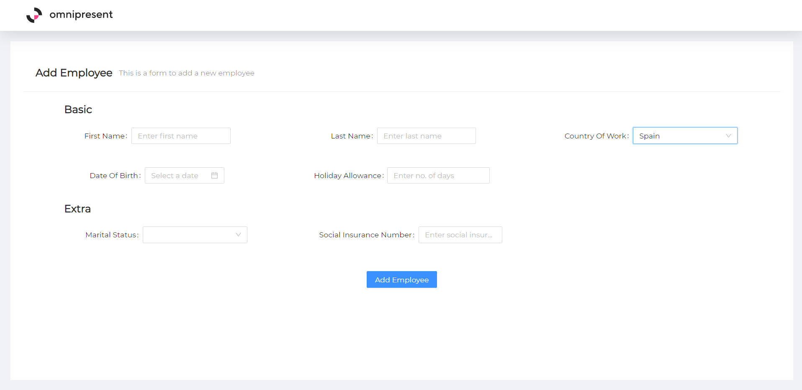

# Omni-Present Take Home Front End Task

## Todo

- Build a dynamic form using ReactJS.
- Change form fields based on country type.
- Validate form fields.
- Update holiday allowance based on country.

## Stack Used

- ReactJS **(Base)**.
- SCSS **(Additional Styling)**.
- Antd **(UI LIbrary)**.
- React Hook Form **(State / Validation Management)**.

## Steps Followed

- Bootstrapped ReactJs Typescript Template.
- Added AntD and SCSS support.
- Added Routing and Navigation.
- Restructured Repo and folder structure.
- Built Basic Form.
- Built Built Form with Conditional Fields.
- Restructured and converted form and form fields to components.
- Updated Form Styles to be visually appealing and responsive.
- Added React Hook Form Support.
- Added State Logic using React Hook Form.
- Added Dynamic Rendering using State Logic.
- Added Basic Validations.
- Updated Validations to custom messages and custom logic for Holiday Allowance.
- Tested Forms using every possible value.
- Wrote Read Me.

## Disclaimer

> Pushed Commits To Repository Regularly.

## How To Execute

- Navigate to root directory.
- Install npm dependencies by running **npm install** in the terminal.
- Run project by running **npm run start** in the terminal.

## Screenshot

